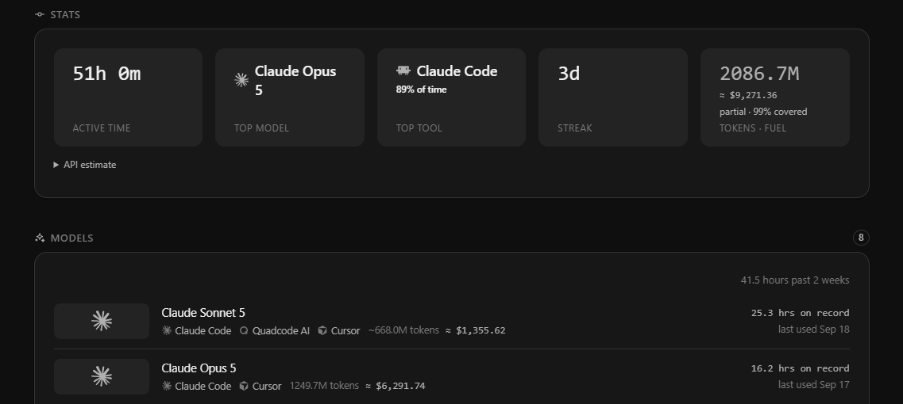
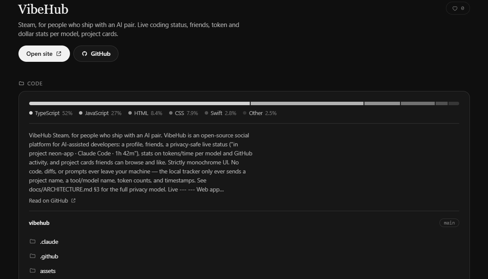

<p align="center">
  
</p>

<h3 align="center">Steam, for people who ship with an AI pair.</h3>

<p align="center">
  Profile, friends, a live "coding right now" status and honest token and $ stats per model.
</p>

<p align="center">
  <a href="https://web-production-da778.up.railway.app"><b>Open VibeHub</b></a>
  &nbsp;·&nbsp;
  <a href="docs/INSTALL.md">Install</a>
  &nbsp;·&nbsp;
  <a href="docs/ARCHITECTURE.md">Architecture</a>
  &nbsp;·&nbsp;
  <a href="docs/DEVELOPMENT.md">Development</a>
</p>

<p align="center">
  
</p>

## What you get

- **Live status** — friends see *neon-app · Claude Code · 1h 42m* the moment you start.
- **Real stats** — active time, tokens and ≈$ per model, streak, top tool.
- **Projects** — paste a GitHub link, get a full page: README, files, languages, pushes.
- **Achievements** — six badges earned from real sessions, never inferred.
- **Vibe Feed** — sessions, unlocks and new projects from you and your friends.
- **Monochrome** — green means one thing: coding right now.

<p align="center">
  
</p>

## Connect

**Mac — the app.** Menu bar, notch island, tracker included.

```bash
curl -fsSL https://web-production-da778.up.railway.app/tracker/mac.sh | bash
```

Or get the `.pkg` from [Releases](https://github.com/EmilSwag/vibehub/releases/latest). Open
VibeHub → **Connect in Browser** → approve → **Start Tracking**. Nothing is tracked before that.
Not notarised yet: if macOS blocks the first launch, use System Settings → Privacy &
Security → **Open Anyway**.

**macOS / Linux / Windows — the connector.** Sign in, press **Connect VibeHub** and copy
the command for your OS. It looks like this:

```bash
curl -fsSL https://web-production-da778.up.railway.app/tracker/connect.sh | VIBEHUB_TOKEN='<device token>' bash -s -- --start
```

```powershell
$env:VIBEHUB_TOKEN='<device token>'; & ([scriptblock]::Create((irm https://web-production-da778.up.railway.app/tracker/connect.ps1))) -Start; Remove-Item Env:VIBEHUB_TOKEN
```

No autostart, no admin rights. `vibehub-tracker uninstall` takes it back out.
Details and troubleshooting: [docs/INSTALL.md](docs/INSTALL.md).

## Supported tools

| | Activity | Model | Tokens & $ | Setup |
|---|---|---|---|---|
| Claude Code | ✓ | ✓ | measured | none |
| Codex | ✓ | ✓ | measured | none |
| Quadcode AI | ✓ | ✓ | not reported | none |
| Cursor | ✓ | when recognised | not reported | `vibehub-tracker hooks install cursor` |
| Windsurf | ✓ | when recognised | not reported | `vibehub-tracker hooks install windsurf` |

ChatGPT (browser or desktop) isn't tracked — it leaves no local record to read.

## Privacy

The tracker reads only the sources above and sends tool, model, timestamps, token counts,
a project alias and your UTC offset. Never code, prompts, diffs or window titles.
Unmeasured tokens stay out of the $ estimate instead of being guessed. Profiles and stats
are public; live presence is friends-only. Full model: [Architecture §3](docs/ARCHITECTURE.md).

## Built with

TypeScript end to end — Express + Prisma + WebSocket on Postgres, React + Vite, a
single-file Node tracker — plus a SwiftUI menu-bar app for macOS. Hosted on Railway.

## License

[MIT](LICENSE)
